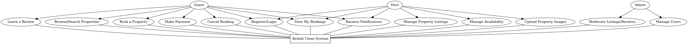

## 🧭 Use Case Overview

This use case diagram illustrates how different types of users interact with the core features of the Airbnb Clone system:

- **Guests** can register, browse listings, make bookings, process payments, cancel reservations, leave reviews, and receive notifications.
- **Hosts** can manage property listings, update availability, upload images, view bookings, and receive notifications.
- **Admins** oversee the platform by managing users and moderating content.

The diagram captures all critical functionalities the backend needs to support for a smooth user experience.

 
